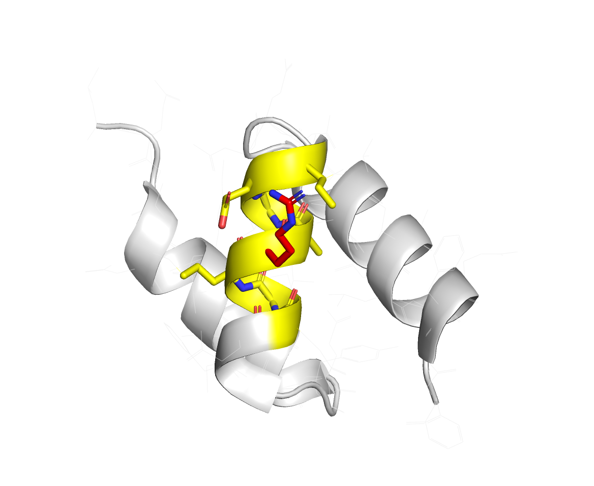
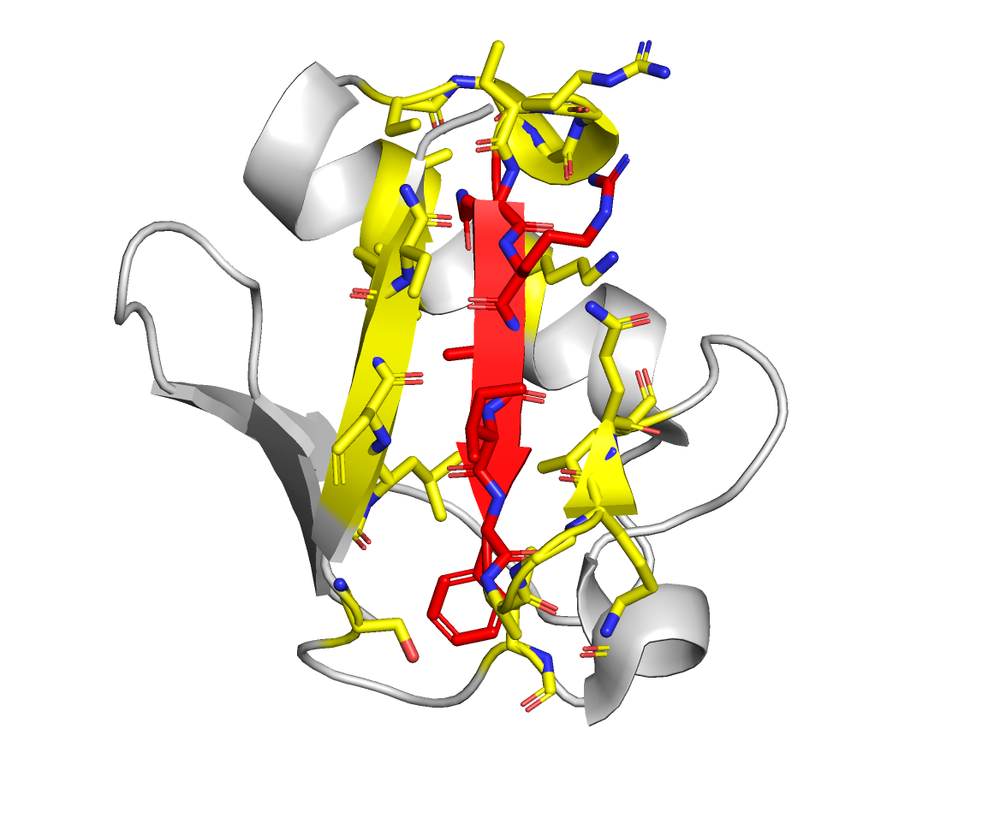

# Active/Passive residues

We have a deeper explanation of these at our [Best Practice Guide](https://www.bonvinlab.org/software/bpg/restraints/) - but for brevity , we can say that:

- Active residues **MUST** be in contact with the other molecule.
- Passive residues **COULD** be in contact with the other molecule.

Let's say you have two proteins A and B; for protein A, you have very high confidence, _based on your experiments, in information retrieved from the literature or bioinformatic predictions_ that residue number 950 is very important for the interaction.

However for protein B you do not know the exact residues involved in the interaction, but you know that the interaction happens in a specific region of the protein. Let's say this region is between residues 41 and 45.

In this example, your active residues are:

- Protein A: 950
- Protein B: 41, 42, 43, 44, 45

For your passive residues, you can select a region **around** your active residues to serve as the passive residues. This is a way to tell the docking software that these residues are not as important as the active ones, but they could be in contact with the other molecule.

> You can do the passive selection manually, by visual inspection or `haddock-restraints` can do it automatically for you, using the `passive_from_active` option.

In the end, your configuration file will look like this:

```json
[
  {
    "id": 1,
    "chain": "A",
    "active": [950],
    "passive": [],
    "structure": "proteinA.pdb",
    "passive_from_active": true,
    "target": [2]
  },
  {
    "id": 2,
    "chain": "B",
    "active": [41, 42, 43, 44, 45],
    "passive": [],
    "structure": "proteinB.pdb",
    "passive_from_active": true,
    "target": [1]
  }
]
```

Visually, the restraints generated by this configuration file will look like this:

| Protein A      | Protein B      |
| ------------- | ------------- |
|  |  |

> Active residues are in red, and the passive residues are in yellow.
